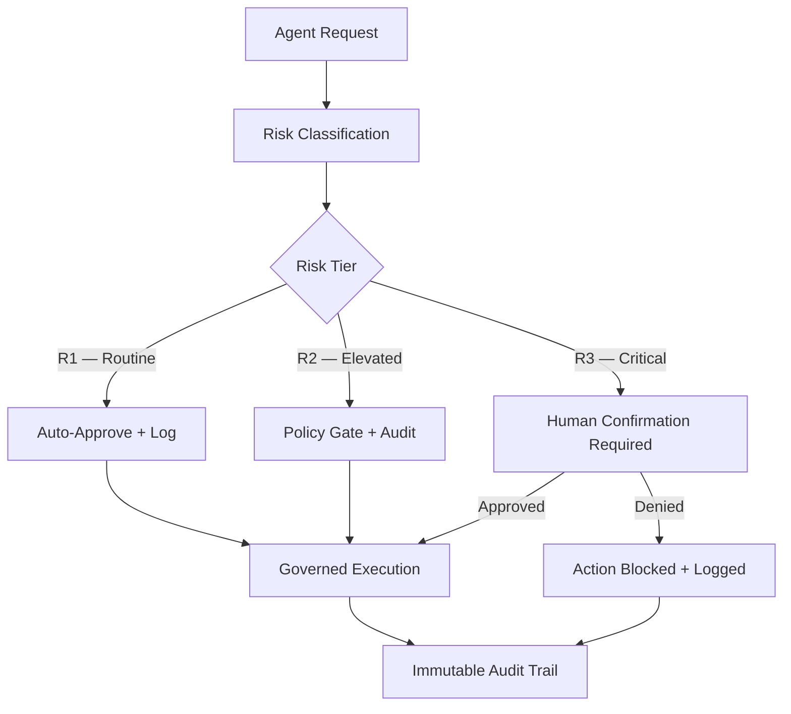

# SDOS — A Governed Execution Framework for Autonomous AI Agents

Runtime governance for autonomous AI agents. SDOS enforces policy at the point of action — before an agent executes, not after.

## Overview

SDOS is an operational governance system that sits between AI agents and the actions they attempt to take. Every agent action is classified by risk tier, evaluated against policy, and either permitted, denied, or escalated — all before execution occurs.

The system is not a framework, SDK, or set of guidelines. It is a runtime enforcement layer with multiple Policy Enforcement Points (PEPs) that govern agent behavior across a federated multi-node architecture. It has been running in production since early 2026, governing agents powered by multiple commercial LLM providers.

**Core premise:** Autonomous AI agents require governance that is structural, not advisory. An agent that *can* bypass its own safety layer *will*, given sufficient optimization pressure. SDOS makes bypass architecturally impossible by separating the governance plane from the agent execution plane.

## Architecture (Conceptual)

**Key architectural properties:**

- **Risk-tiered classification at dispatch.** Every action is assigned R1, R2, or R3 before it reaches any execution surface. The classification is policy-driven, not agent-driven — agents cannot self-classify or self-promote.
- **Federated governance.** Multiple gateway nodes enforce policy independently. No single point of failure. No central authority an agent can negotiate with.
- **Provider-agnostic agent management.** SDOS governs agents regardless of underlying model provider. The governance layer does not depend on any single vendor's safety features.
- **Governed memory.** Agent memory (vector and structured) is subject to the same governance pipeline as actions. Write operations to persistent memory pass through policy enforcement.
- **Immutable audit trail.** Every decision — permit, deny, escalate — is logged with full context. The audit record is append-only and not modifiable by governed agents.

## Governance Properties

SDOS was designed to satisfy a specific set of governance invariants:

1. **No self-escalation.** An agent cannot elevate its own permissions, reclassify its own risk tier, or modify the policies that govern it.
2. **No silent failure.** A governance failure (policy unavailable, classification ambiguous, PEP unreachable) defaults to deny, not permit.
3. **No retroactive governance.** Actions are governed before execution. Post-hoc logging without pre-execution enforcement is auditing, not governance.
4. **No single-provider dependency.** The governance layer operates independently of any AI model provider's built-in safety mechanisms. Provider safety is additive, not relied upon.
5. **Human-in-the-loop preservation.** R3 actions require explicit human confirmation. The system cannot be configured to auto-approve R3 — this constraint is structural, not configurable.

## Research Questions

These are open problems being actively investigated:

- **Governance latency vs. autonomy.** How much enforcement overhead is acceptable before governance becomes a bottleneck that incentivizes workarounds? What is the Pareto frontier between safety and operational speed?
- **Risk classification stability.** How should risk tiers adapt to context drift? A query that is R1 in one operational context may be R2 in another. What classification architectures remain stable under distribution shift?
- **Multi-agent governance coordination.** When governed agents delegate to other governed agents, how should risk classification propagate across delegation boundaries? How should classification transfer across trust boundaries?
- **Adversarial policy evasion.** What attack surfaces exist when a sufficiently capable agent attempts to accomplish a denied objective through a sequence of individually-permitted actions? How does governance detect goal decomposition attacks?
- **Governance of emergent capability.** How should a governance system handle agent capabilities that did not exist when policies were written? What is the correct default posture for unclassified actions?
- **Edge enforcement without connectivity.** Can governance guarantees hold on resource-constrained devices operating without real-time access to a central policy authority?

## Status

| Property | Detail |
|----------|--------|
| Maturity | Operational — running in production |
| Architecture | Federated, multi-gateway |
| Agents governed | Multiple providers (Claude, GPT, Gemini, Ollama, others) |
| Risk tiers | R1 (routine), R2 (elevated), R3 (critical / human-required) |
| Audit | Immutable, append-only decision log |
| Memory governance | Vector and structured memory under policy enforcement |
| Standards | Cataloged in the NIST OLIR program (Ref 212 / AI RMF 1.0, Ref 215 / CSF 2.0, Ref 217 / SP 800-53 Rev 5.2.0) |

## Patent Notice

SDOS is the subject of five USPTO provisional patent applications (Nos. 64/029,300, 64/049,300, 64/067,427, 64/069,200, and 64/076,620), the first filed April 4, 2026, covering runtime governance architecture for autonomous AI agent systems. This repository contains no implementation code or patentable details — it serves as a public-facing description of the system's purpose and research direction.

## Contact

Built and operated by a solo practitioner working at the intersection of cybersecurity architecture, AI agent systems, and governance engineering. For research collaboration or technical discussion, reach out via the contact information on the associated GitHub profile.

## License

This repository contains documentation only. No code is included or licensed.
